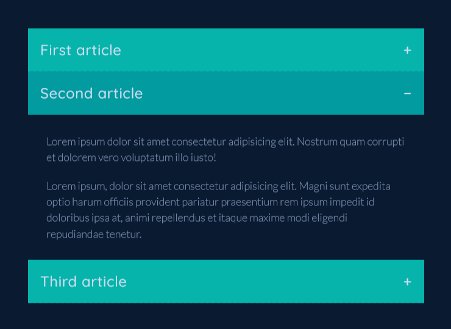
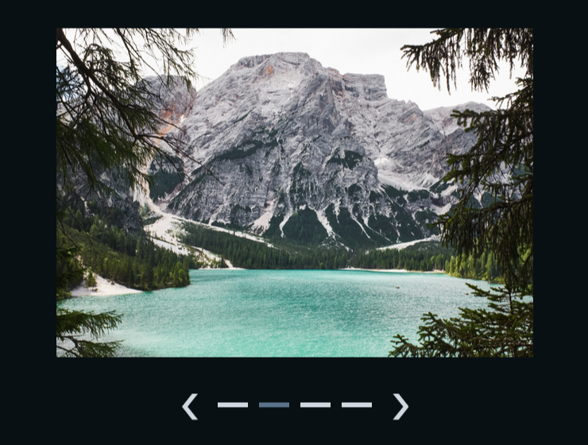
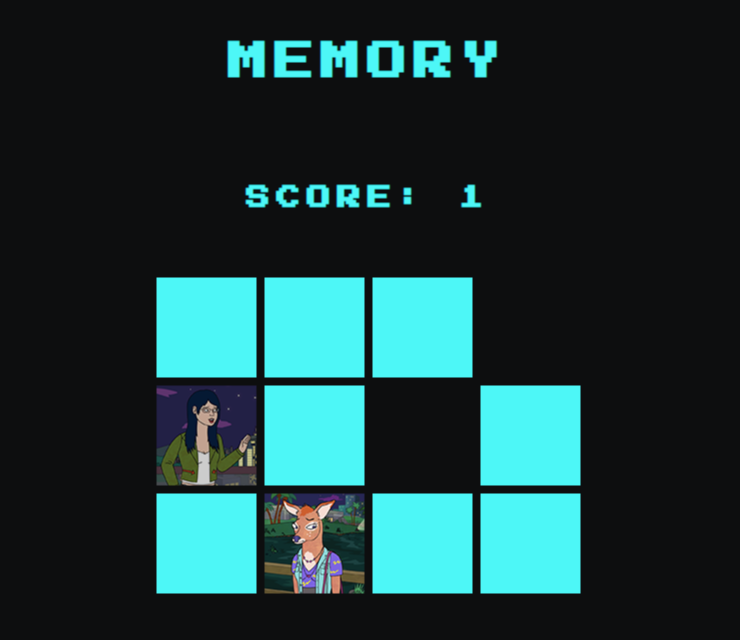

This is my second solo project completed during the front-end bootcamp at InfoShare Academy.

The task was to build 2 features and 1 game using HTML, CSS and JavaScript.

1. [Accordion](https://double-vee.github.io/bootcamp-project-2/features/accordion/index.html)

2. [Carousel](https://double-vee.github.io/bootcamp-project-2/features/carousel/index.html)

3. [Memory](https://double-vee.github.io/bootcamp-project-2/games/memory/index.html)

